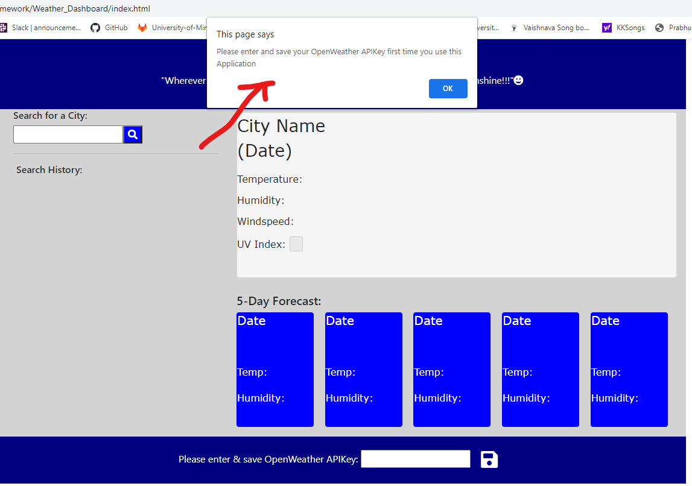
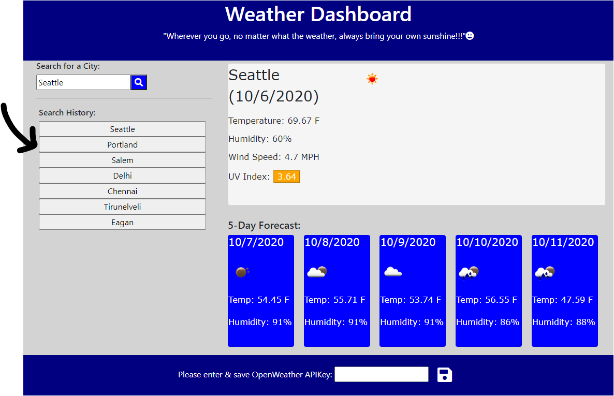

# Weather_Dashboard

Weather Dashboard application provides users with current and 5-day forecast of weather. 

## Description
```
Weather Dashboard features smart search option to lookup current and 5-day weather forecast. 
The dashboard provides valuable information like, temperature, humidity, wind-speed, UVIndex along with icon representation of the weather. It also presents the UVIndex with approproate color to show if the consition is favorable, moderate or severe.
The App also adds the searched cities as a button that is available for quick search in the future. Any time the user clicks on the searched city buttons, the forecast of that city is freshly pulled again from the weather public API. 
The searched cities are also persisted in the local storage, so it is easily available for the user in their future weather forecast needs.


The weather information is sourced by third-party API  [OpenWeather API](https://openweathermap.org/api). to retrieve weather data for cities. The documentation includes a section called "How to start" that will provide basic setup and usage instructions. Use `localStorage` to store any persistent data.
```

## Screenshots/Images to demonstrate the application functionality:






## How to Use
```
1)Enter a City in the textbox that is under "Search for a City:" label, and click the Search button 
2) You would see the cityname appear in a Search History area
3) Also the current and future weather conditions of the city is presented to the user. The information includes temperature, humidity, wind speed and the UV index.
4) The UV Index also has color coding that indicates whether the condition are favorable, moderate or servere
5) 5-day forecast for that city is also displayed with the date, icon to represent the weather condition, temperature and the humidity.
6) When the user clicks any of the city names under the search history, the current and 5-days forecast is pulled again from OpenWeather third-party API.
7) Everytime a search of a city is made, the history of the search is saved in the local storage for future use.
8) Every time the user uses the application, they will be presented with their city search history for quicker search option.

```
## Tools and Techniques
```
1) Bootstrap CDN
2) Font Awesome
3) OpenWeather API
4) Local Storage 
```

## URL

* The URL of the deployed application - https://meenaambalam.github.io/Weather_Dashboard/

* The URL of the GitHub repository - https://github.com/meenaambalam/Weather_Dashboard